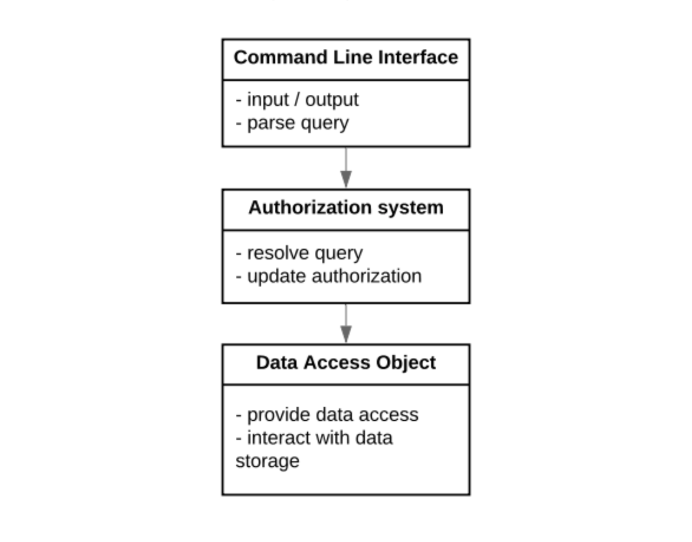
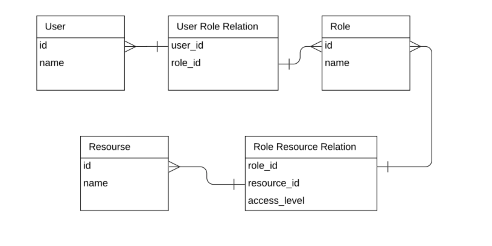

# rbac
Role Based Access Control System

## Overview
Basic role based access control (authorization) system.

### Functional requirements
1. Given a user, action type and resource system should be able to tell whether the user has access or not.
2. System should be able to assign a role to user and remove a user from the role.

### Behavioral requirements
1. Access to resources for users are controlled strictly by the role.
2. One user can have multiple roles.

## Design
Design is kept simple, modular and extensible.

### Modules



There are three modules:
1. Command line interface: The module responsible for interaction with the end-user. Currently it is basic command line interface, but later it can be changed/replaced without affecting other modules. For example: it can be replaced by REST API.
2. Authorization System: This module contains the logic to determine if the user is authorized for certain action on the resource.
3. Data Access Object: This module is responsible for interacting with the storage and provide the data to the application. Currently it reads from csv file, and keeps the data in memory. It can easily be replaced with another DAO which interacts with Database.

### Data
Data is represented as Entities and relationships.



#### Entities
1. User: All the information about the user.
2. Role: All the information about the role.
3. Resource: All the information about the resource.

#### Relationships
1. User Role Relation: The Many-to-many relationship between users and roles.
2. Role Resource Relation: The Many-to-Many relationship between roles and resources.

### Implementation
Implementation is done in python3.6. No external library is used.

####Files

##### user_iterface.py
This file represents Command line interface module. It interacts directly with authorization module, but not with data access module.
The function start contains the loop to receive and execute the command.

##### authorization.py
This file represents Authorization system module. It interacts directly with data access module.
It provides functions: is_authorized, add_role_to_user and remove_user_from_role.

##### data_access_object.py
This file represents Data Access Object module. It interacts with storage(csv files) to provide data access to other modules.

##### models.py
This file contains the definition of entities and relationships.

##### main.py
This file stitch together all the module into an application.

##### exceptions.py
This file contains definition of commonly occurring exceptions.

## Usage/Execution
The system can be started using command
```
python main.py
```
The program load the data from data directory and provides a command prompt for basic functionality.
### Commands
1. `help`: To know about available commands.
2. `users`: To see all users.
3. `roles`: To see all roles.
4. `resources`: To see all resources.
5. `assign <user_id> <role_id>`: To assign a user to a role.
6. `remove <user_id> <role_id>`: To remove a user from a role.
exit: To exit from command prompt.
